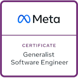
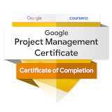
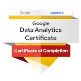
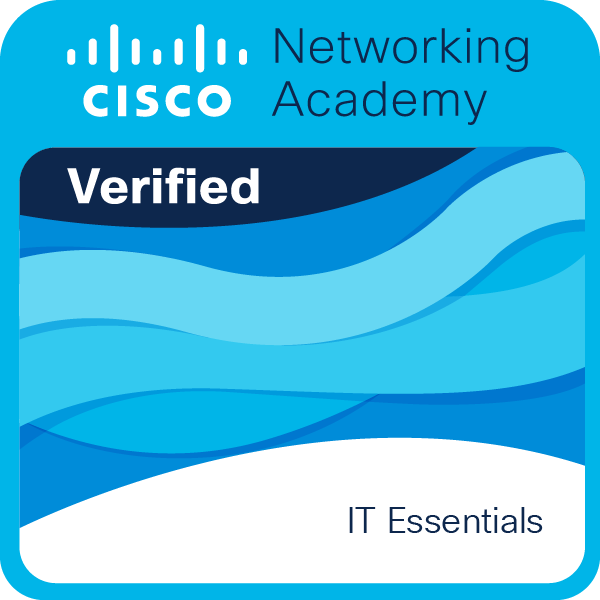
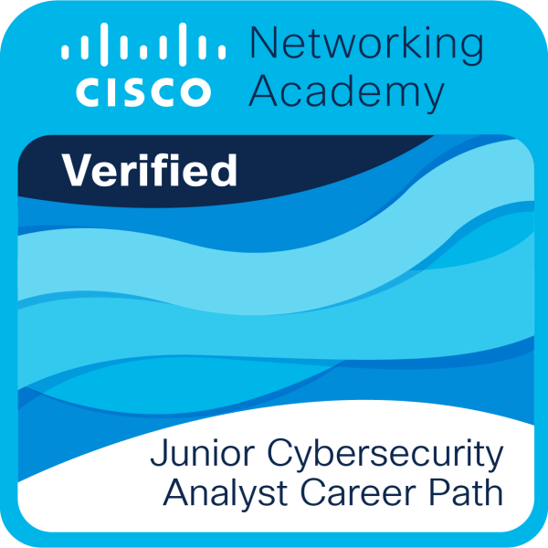

# 👋 Hi, I'm Pedro

I'm a software developer based in Porto, Portugal. Since 2017, I build scalable applications and grow through hands-on experience with international teams.

### 🌍 Projects & Collaboration
I contribute to large-scale projects with companies like **[TUI](https://tui.com/)** and **[DISH](https://www.dish.co/)**, working in agile environments across diverse tech stacks.

### 🛠️ Tech Stack
I have experience in a variety of programming languages, frameworks, and tools. Here are some of the technologies I work with:

### 🧠 Always Learning
- **Current Studies:**
  - IT Systems & Programming @ ATEC (2023–2025)
  - Web Development @ Instituto Politécnico do Porto (2022)

- **Certifications:**
  - [Building Cloud Computing Solutions at Scale Specialization - *Duke University*](https://www.coursera.org/account/accomplishments/specialization/certificate/VMK5GP2W6CA3)
  - [CS50’s Web Programming with Python and JavaScript - *HarvardX*](https://certificates.cs50.io/7155bca1-7aff-4d98-912d-14ec75171685.png?size=letter)
  - [CS50’s Introduction to Computer Science - *HarvardX*](https://certificates.cs50.io/b3f78857-3c42-4fa6-99bc-3ee8fd1158ed.png?size=letter)
  - [Blockchain Specialization - *University at Buffalo*](https://www.coursera.org/account/accomplishments/specialization/certificate/SN2MKMGGRKLK)
  - [DevOps on AWS Specialization - *AWS*](https://www.coursera.org/account/accomplishments/specialization/certificate/7RBAURPJFKY2)

  
  
  
  
  
  
  

---

📫 **Reach out:** I'm always open to connect, collaborate, or talk about tech.
